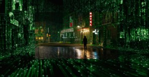
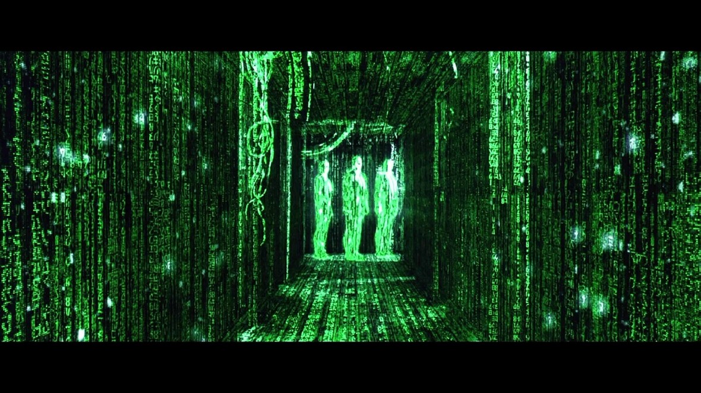

# Quiz8_lyue0331

### I aim to incorporate the "Code Rain" effect from The Matrix into my project to create a virtual world of present scenery.
1. #### *Redrawing Scenery with Code Lines*: 
##### utilizing the **density of code lines** to depict highlights and shadows in the scenery.

   
2. #### *Continuous Motion of Falling Code*: 
##### using **controlled speed** to simulate the dynamic effect of raindrops with falling code lines.

 
3. #### *Interactive Experience with "Code Rain"*: 
##### **changing the direction of falling code** by touching it. Additionally, **the shape, speed, and color of code lines** can be altered through other interactive ways.

### This code technique forming an ASCII art-like representation of the image:[example project Link](https://editor.p5js.org/codingtrain/sketches/LNBpdYQHP) 

1. #### *Turn the image into characters*:
##### **First**, obtain the pixels of the image. 
##### **Second**, ensure the color and position of every pixel related to a specific character.
2. #### *Create Moving Characters*:
##### **First**, initialize the index of every character to track its position in the text. 
##### **Second**, increase the index of the characters in a loop.
3. #### *Control the Speed of Motion*:
##### Initialize the rate with frameRate() to ensure the characters move at a stable speed.
